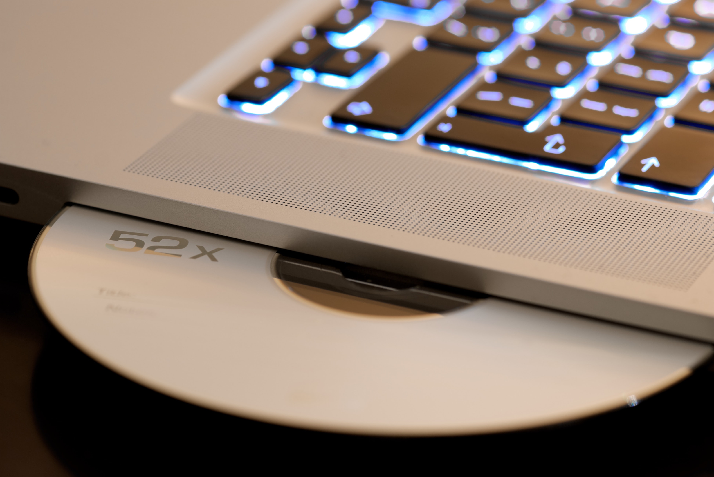

import TitleBar from "../../components/titleBar.js";

<TitleBar
  size={"20px"}
  bkgdColor={"#cfdac8"}
  text={props.pageContext.frontmatter.title}
/>

Apakah yang anda putuskan sebelum anda membeli laptop? pastinya, setiap individu akan fokus kepada fitur-fitur seperti ukuran hard disk, RAM, ukuran layar, fitur layar sentuh dsb.tetapi sadarkah anda kalo laptop-laptop keluaran terbaru kebanyakan ternyata tidak dibekali dengan adanya DVD drive mengapa demikian ?
maka, apa saja  yh alasan produsen laptop tidak memberikan fitur DVD drive? mari kita simak berikut.

<h2>inilah 5 alasan Laptop Keluaran baru tidak mempunyai DVD Drive</h2>

<h3>1. beda disk maka beda pula panjang gelombang yang dibutuhkan</h3>

Tahukah kalian jika drive disk optik memakai laser guna membaca dan menulis sebuah data? Jika berbeda jenis disk, maka beda pula panjang dari gelombang yang diperlukan. Drive optik yang berkerja dengan banyak jenis disk memiliki banyak laser yang terkandung, 
bagi CD dengan cakram padat,mengunakan panjang gelombang 780 nanometer nm. Panjang tersebut terdapat dalam kisaran inframerah. Lalu untuk DVD cakram video digital mengunakan panjang gelombang sekitar 650 nanometer. Sedangkan untuk Blu-ray mengunakan panjang gelombang sekitar 405 nanometer.

<h3>2. karena musik dan video dapat diakses melalui internet</h3>

lalu, mengapa DVD drive sudah mulai ditiadakan dari laptop? Karena tidak lain dan tidak bukan disebabkan oleh kebiasaan kita sendiri dan semakin berkembangnya teknologi terus menjadi lebih cangih.
dahulu, jika untuk anda bisa mendengarkan musik, anda harus memasukkan DVD ke dalam drive laptop, Begitupun dengan saat inggin menonton film dan video,di jaman dulu anda harus memiliki DVD agar dapat menontonnya.
Tetapi sekarang ini, kita semua hanya perlu gadget atau laptop untuk bisa mendengarkan musik ataupun menonton sebuah film. Mungkin kalian bisa saja tinggal streaming film di internet tanpa harus menyetel melalui DVD drive, akibatnya DVD drive jadi mulai jarang sekalih dipergunakan. dan inilah yang mengakibatkan produsen laptop sangat mempertimbangkan untuk tidak memasang DVD drive dan meniadakan DVD drive.

<h3>3.Kita sudah tidak menyimpan file di dalam keping DVD lagih</h3>
 
 Kalo dulu anda harus menyetok DVD sebanyak-banyaknya supaya dapat menyimpan file.tapi sekarang ini teknologi semakin maju, anda pasti lebih memilih untuk menyimpan file di hard disk eksternal ataupun diunggah di sistem penyimpanan cloud seperti Google Drive dan Dropbox. Hingga akhirnya, keping DVD pun sudah mulai jarang sekali dipakai untuk menyimpan sebuah file. pilihan penyimpanan seperti itu dinilai lebih efisien, praktis juga murah daripada harus dengan menyimpan file di keping DVD. Tak hanya itu jika saja kepin DVD tergores, berdebu, kotor dan basah, dapat mengakibatkan kerusakan dan menghilangkan file yang ada di dalamnya. Maka anda harus berhati-hati jika menyimpan keping DVD bila saja tak ingin file itu rusak dan hilang nantinya.
 
 
<h3>4.berbagi film mudah dilakukan melalui penyimpanan cloud dibanding DVD</h3>

Kita semua semakin dipermudakan dengan terdapatnya sistem penyimpanan cloud seperti Google Drive, Dropbox atupun Microsoft OneDrive. Anda bisa saja menyimpan banyak file berukuran besar bahkan juga bisa langsung membagikannya ke orang lain. Dengan adanya fitur sharring ,teman-teman anda bisa men download file dengan cepat juga mudah.
Seperti itulah mengapa sebabnya keping DVD tak lagi begitu dibutuhkan. Bayangkan saja betapa merepotkan jika kita harus mengandalkan copy file dengan keping DVD. Sangat jauh lebih merepotkan dapat menguras banyak tenaga dan waktu. Dikarenakan pertimbangan tersebut, akhirnya banyak dari produsen laptop yang meniadakan DVD drive.

<h3>5. Tanpa adanya DVD drive, laptop menjadi lebih tipis dan ringan</h3>

DVD drive membutuhkan banyak ruang yang cukup besar di body laptop. Dengan adanya DVD drive laptop akan terasa lebih tebal juga berat. Laptop yang terasa berat dan dimasukan ke dalam tas ransel mengakibatkan otot leher, punggung juga bahu menjadi tegang. Bila saja kita terus-menerus membawa beban yang berat di dalam tas, hal ini bisa saja merusak postur tubuh kita.
Tak hanya itu, desain dari laptop yang lebih tipis dan ringan lebih banyak digemari dikarenakan terlihat lebih menarik secara visual dan body. Tak hanya itu laptop yang berbody tipis juga kebanyakan memiliki harga terjangkau di kantong, tetapi performanya tetap terasa optimal. Dengan mentiadakan DVD drive laptop terasa lebih tipis dan juga ringan.

<h4>kesimpulan</h4>

itulah lima ulasan kami dalam membahas alasan laptop keluaran terbaru saat ini sudah banyak yang tidak dilengkapi DVD drive,memang semakin bertambah nya era juga dibarengi dengan bertumbuhnya teknologi, pasti kebiasaan hidup baru di masyarakat akan ikut berubah apalagi orang sekarang memiliki karakter maunya serba instan dan efisien tanpa ribet-ribet begitu pun dalam hal menyetel video atau menyimpan file semua nya dilakukan dengan sangat mudah tanpa perlu membuang waktu mengunakan DVD drive lagih.dan bagi anda yang mungkin mebutuhkan referensi laptop bagus dan murah anda bisa saja mengunjungi [laptop murah terpercaya](https://grosirlaptop.xyz/).

