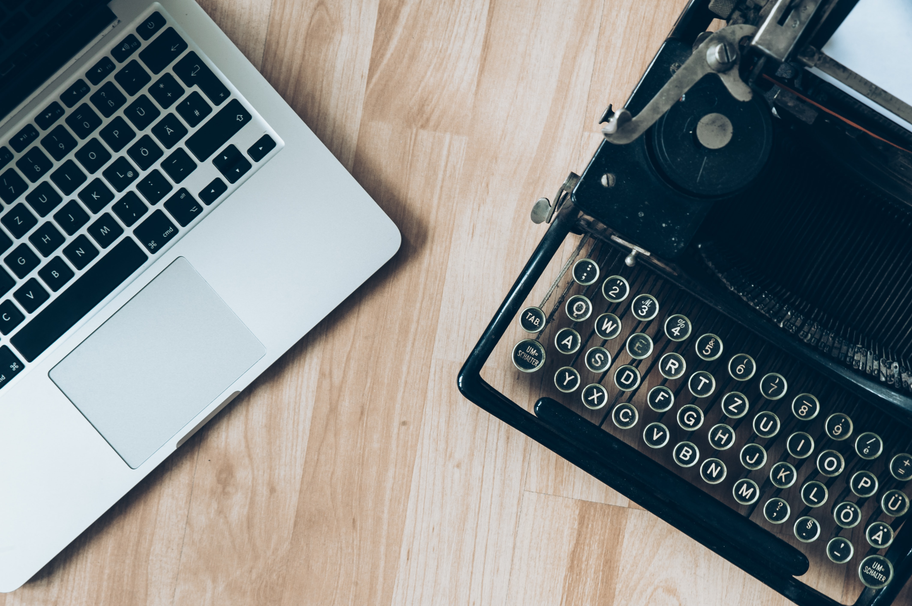

import TitleBar from "../../components/titleBar.js";

<TitleBar
  size={"20px"}
  bkgdColor={"#cfdac8"}
  text={props.pageContext.frontmatter.title}
/>

Dua orang bernama Adam Osborne juga Alan Key ialah yang menciptakan sebuah Personal Komputer yang pertaman didunia sekitar tahun 1981.dengan berat sekitar 24Kg. Komputer tersebut dibandrol seharga 16 juta rupiah.
Teknologi di jaman saat ini telah terdapat di banyak belahan dunia. Dunia sudah mengenal lama komputer jinjing atau yang biasa disebut dengan laptop. Komputer jinjing yang  sudah mempunyai teknologi tinggi dalam bentuk ukuran fleksibel juga mudah dibawa, tak lain telah sudah cukup lama datang sebagai pengganti dari Personal Computer atau (PC) untuk di urusan mobile workstation, mulai dengan mengetik, browsing di internet, desain, gaming, content creator, editor, dsb.
tapi taukah kalian tentang bagaimana sejarah berkembangnya laptop di dunia pertama kali? Darimana kah awalnya laptop tersebut berasal, sehingga sampai detik ini dapat membantu segala keperluan pengguna di dalam urusan pekerjaan.

Berawal pada sekitar awal tahun 70an, rencana banyak para ahli didalam menciptakan suatu perangkat komputer yang bisa dipergunakan dan bisa dibawa ke berbagai tempat sudah menjadi pembicaraan yang serius di kalangan para produsen juga desainer PC. melewati hasil karya tangan Alan Key, seorang penulis buku komputer yang juga adalah  pemilik dari suatu perusahaan pencetakan buku. dari saat itu, bermuculanlah berbagai jenis komputer mikro dengan fungsi masing-masing yang berbeda.
Di dalam isi bukunya tersebut, Alan menjelaskan tantang bagaimana konsep dasar dari komputer yang bisa dibawa kemana-mana dan tak diperlukan sambungan aliran listrik di setiap saat. Konsep itu disebut juga sebagai personnel, portable information manipulator. Dari situlah awal sejarah dari laptop dimulai. berawal sebuah ide, berakhir menjadi sebuah kreasi teknologi yang digunakan secara luas sampai saat ini.

Alan Key sendiri pun merupkan seorang ilmuwan komputer dari Amerika yang memiliki ide kreatif  untuk menciptakan sebuah laptop yang pertama kalinya. Sesudah itu dia bantu dengan Adam Osborne, seorang pembuat software yang juga sama bekerja di penerbitan buku di Amerika.
walaupun Alan merupakan pengagas ide yang pertama dari penerbitan laptop, tetapi dia bukanlah orang yang akhirnya menciptakan laptop tersebut. Sejarah dari laptop yang  pertama malah terciptakan dari hasil usaha Adam Osborne di sekitar tahun 1975. di dalam menjalankan idenya itu dia bekerjasama dengan Felsenstein, yaitu seorang yang memiliki perusahaan produsen perangkat keras, yang kebetulan juga ialah merupakan profesional yang ahli didalam pembuatan sirkuit prosesor.
Sejarah kemunculan laptop awalnya ditandai oleh kedatangan IBM Portable PC 5100 sekitar pada tahun 1975. itu merupakan komputer mikro yang pertama dibuat khusus untuk keperluan matematika juga engineering. Sesudah itu berdatangan produk yang mempunyai fitur yang lebih lengkap contoh: Rockwell AIM 5, IBM Portable PC 5110, sampai Heathkit H9.

 sekitar tahun 1981, Osborne Computer Corporation berhasil menciptakan perangkat yang diberi nama Osborne 1. walaupun masih memiliki banyak kekurangan, perangkat ini bisa disebut sebagai komputer portabel yang pertama di dunia. dari awal kedatanganya, Osborne 1 mempunyai bobot mencapai 24 kilogram dengan dirancang secara khusus agar bisa muat di bawah kursi penumpang pesawat. Osborne 1 ialah microcomputer yang memulai sejarah adanya laptop di dunia. Ukuran dari laptop ini hanya sebesar 5 inci juga  keyboard yang sudah menempel langsung ke monitor. Laptop yang pertama kali ini diproduksi dengan massal dan dibandrol dengan harga mencapai  kisaran USD 1,795 atau sekitar 16 jutaan rupiah. Sebuah Harga yang sangat mahal, sehingga tidak banyak orang dapat memilikinya.

di saat yang sama, IBM juga menjual komponen PC dengan cara terpisah, alhasil orang lebih tertarik  untuk menguanakan Osborne 1 yang portabel juga bisa langsung digunakan tanpa perlu merakit terlebih dahulu. tetapi perjalanan perusahaan Osborne mengalami penurunan di kisaran awal tahun 1983, ketika ia mengakui adanya kebohongan, bila sudah mempunyai dua desain komputer canggih yang telah siap dipasarkan. Dan Kenyataannya ialah hal itu hanya cara agar perusahaannya memiliki penambahan konsumen yang lebih banyak. Karna hal tersebut penjualan laptop osborne 1 mengalami penurunan drastis.

Sejarah dari laptop inilah yang menjadi sumber utama pendapatan dari perusahaan Osborne. tepatnya pada tanggal 13 September 1983, Osborne Computer Corporation telah dinyatakan mulai bangkrut juga penjualan Osborne 1 mulai terhenti sejak itu juga. Tetapi  hal tersebut ternyata menumbuhkan tren baru di dunia perkomputer, dikarenakan produsen lain akhirnya memutuskan mengikuti jejak dari Osborne untuk membuat seri laptopnya sendiri. Sejarah dari laptop pun masih terus berlanjut.

Dan Pada akhirnya, dengan perkembangannya, laptop sampai saat ini sudah banyak menghasilkan keuntungan bagi para penggunanya. Hal tersebut karena pengunaanya yang mudah dan efisien, cepat juga praktis. Selain bentuk dan modelnya  saat ini sudah semakin beragam, dengan desain yang lebih menarik hampir banyak laptop yang beredaran di saat ini sudah ringan juga minimalis. Selain fitur yang ditawarkan sangat begitu menarik perhatian,  bahkan pula beberapa laptop sudah terdapat fitur touch screen, juga perangkat software dan hardware yang lebih bagus dari masa pertama kehadirannya. Dan ke depannya akan lebih menawarkan banyak fitur yang lebih canggih lagih, dikarenakan ilmu di bidang teknologi saat ini terus berkembang pesat dan para ilmuwan juga terus  upgrade mengembangkannya.

<h4> kesimpulan </h4>

dan itulah pembahasan saya mengenai sejarah awal munculnya laptop di dunia,seperti itulah sebuah kemajuan teknologi berkat adanya sebuah laptop di jaman sekarang segala keperluan kita dapat di kerjakan dengan mudah bayangkan saja bila dari dulu sampai sekarang belum ada teknologi seperti laptop,mungkin setiap rumah perlu adanya pc karna untuk menunjang pembelajar pekerjaan kantor dsb, namun itu kurang efisien mengingat pc sendiri tidak dapat di bawa kemana, tapi dengan adanya laptop kita bisa menyelesaikan segala pekerjaan dengan lebih efisien di mana sajah karna laptop dapat di bawa-bawa,dan mungkin bagi kalian yang juga sedang membutuhkan sebuah laptop untuk keperluan kerja,belajar dsb sini kami merekomendasikan sebuah [laptop murah terpercaya](https://grosirlaptop.xyz/).yang rekomen untuk anda
